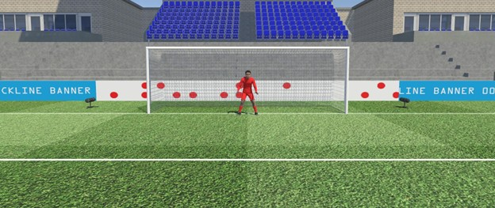

# The influence of moving visual contextual information on decision-making

Mueller, de Hoop, Crowe, Mann

## Documentation
- Python code and anonymized data for replication (`VUPenaltyTaker.Python/`)
- Unity3D project source code (`VUPenaltyTaker.Unity/`)

## Requirements (Unity)
- [SteamVR](https://store.steampowered.com/app/250820/SteamVR/) (tested with version 1.21.8)
- [Unity 6000.0.19f1](https://unity.com/releases/editor/archive)

## Requirements (Python)
- see `VUPenaltyTaker.Python/pyproject.toml`

